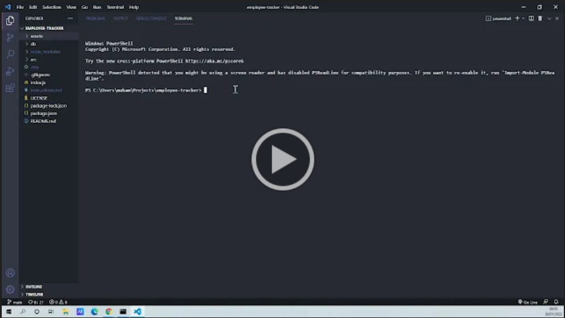

# employee-tracker

[](https://opensource.org/licenses/MIT)

## Description

A Node.js command-line application that allows non-developers to easily view and interact with information stored in databases. These interfaces is also referred to as a **content management systems (CMS)**.

The command-line application from scratch to manage a company's employee database, using Node.js, Inquirer, and MySQL.

## Table of Contents

- [Description](#description)
- [Installation](#installation)
- [Usage](#usage)
- [Directory Structure](#directory-structure)
- [Technologies Used](#technologies-used)
- [Tests](#tests)
- [Features](#features)
- [Appearance](#appearance)
- [Setup](#setup)
- [Demo](#demo)
- [Acknowledgements](#acknowledgements)
- [Questions](#questions)
- [License](#license)

## Installation

​Install dependencies using:

    npm install

## Usage

The application will be invoked by using the following command:

    node index.js

## Directory Structure

```md
.
├── **tests**/
│ ├── XXX.test.js
│ ├── XXX.test.js
│ ├── XXX.test.js
│ └── XXX.test.js
├── assets/
├── lib/
├── src/
├── .gitignore
├── index.js
└── package.json
```

## Technologies Used

- Node.js
- MySQL
- Inquirer
- JavaScript
- Jest

## Tests

Run test using:

    npm run test

## Features

## Appearance


## Setup

- Nodejs must be installed
- MySQL must be installed
- Text editor (VS Code recommended)

## Demo

[](https://drive.google.com/file/d/1KAaGDYgHObkcrLzAKw4rKIMEY04-3JRm/view)

## Acknowledgements

- https://www.npmjs.com/package/jest
- https://www.npmjs.com/package/mysql2
- https://www.npmjs.com/package/inquirer

## Questions

Created by: [@moedaaboul](https://github.com/moedaaboul)

Feel free to contact me via [muhammad.daaboul1989@gmail.com](muhammad.daaboul1989@gmail.com)!

## License

This work is licensed under
[MIT](#).
